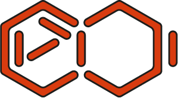

<h1>
   
  
   
  Creative Machine Learning
   
</h1>

<h3>Creative Machine Learning in MaxMSP and Ableton Live.</h3>

<i>Course given at IRCAM in March 2026 by <a href="http://esling.github.io" target="_blank">Axel Chemla-Romeu-Santos</a> and Nils Demerlé</i>

<!-- <h4>
  <a href="#lessons">Lessons</a> •
  <a href="#setup">Setup</a> •
  <a href="#administrative">Administrative</a> •
  <a href="#details">Detailed lessons</a> •
  <a href="#contribution">Contribution</a> •
  <a href="#about">About</a>
</h4>

 -->

## Lessons

### Course 1 - Introduction

 
<!--   -->

This course provides a brief history of the development of artificial intelligence and introduces general concepts of machine learning through simple examples, before jumping in more recent applications to music. 

To complement the slides, two browser-based interactive demos are available:

**[Polynomial Regression](https://nilsdem.github.io/creative_mL_maxmsp/linear_regression/)** – Basic machine learning problem of polynomial regression with gradient descent.

**[MNIST VAE Playground](https://nilsdem.github.io/creative_mL_maxmsp/mnist_vae/)** – Train a small VAE on the Mnist dataset and explore its 2D latent space. 

### Course 2 - ACIDS tools : Rave, After and nn~
 

This course focuses on embedding neural tools (Demucs, Rave, VSChaos and AFTER) in MaxMSP and Ableton Live using the nn~ library. To follow the course you will need to download models and max patches [here](https://drive.google.com/drive/folders/1C2XaZxJYSKG5VBf_RK1uO5W5R1bA06d5?usp=sharing).

Additionaly, you need to install nn~ : https://github.com/acids-ircam/nn_tilde.

**[PCA](https://nilsdem.github.io/creative_mL_maxmsp/demo_pca/)** – Playground to experiement with Principal Component Analysis (PCA) from 3D data to 2D PCA representation. 

### Course 3 - Train and bend your own models
TBA

### Course 4 - Personnal projects
TBA

## Discord channel

Join the [ACIDS Discord channel](https://discord.gg/juWFbvSHvD) to join the community and share ressources, experiences and problems.

## Full calendar

| Date | Course |
|----------:|:-------------|
| March 3 | 01 - Machine learning |
| March 10 | 02 - Acids tools |
| March 17 | 03 - Train and bend |
| March 31 | 04 - Personnal projects |

## About

Code and documentation copyright 2012-2042 by all members of ACIDS. 

Code released under the [CC-BY-NC-SA 4.0 licence](https://creativecommons.org/licenses/by-nc-sa/4.0/).
